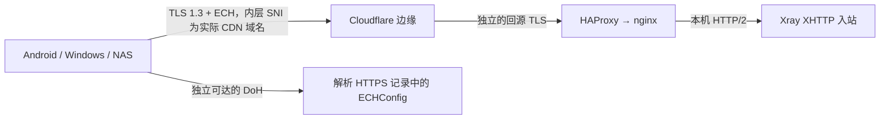

# v26.9.9 参数契约：REALITY、XHTTP、Cloudflare 与 ECH

> 核对日期：2026-09-12。Xray 基线：`v26.9.9`，提交 `52a412d9e2f5c2a5142b1b4e2ab3771dacb8b120`。
> 状态：官方字段、固定版本源码与相关社区讨论已核对；下述生成器调整、客户端导入和真实网络验收尚未实施。
> 本文约束 [生产就绪计划](PLAN-PRODUCTION-READINESS.md) 的 T04/T07/T10/T11；现场操作见 [测试 VPS 验收手册](TEST-VPS-RUNBOOK.md)。后续最新版仍包含预发布，按主计划推进版本及参数修订。

## 1. 当前结论与已作出的决定

**参数规划已细化，但当前项目还没有达到“所有参数均已实现并验证可用”的状态。** 当前代码仍有 H3 ALPN 层级、IPv6 split 地址、旧 `xmux` 输出和无效 ECH 开关等问题。`v26.9.9` 的原生核心、v2rayNG/v2rayN 的 URI 导入源码提供了实现 ECH 的基础；用户实际安装版本、Cloudflare zone 和大陆接入网络尚未验证。

本轮补充查阅了 Xray 仓库的 XHTTP 主讨论、分享规范、ECH PR 和故障讨论。社区案例用来设计测试，字段含义及默认值回到官方 `docs/stable/config/`、`source/` 和固定提交核对。不能把旧评论中的参数原样写回新模板。

| 问题 | 决定与边界 |
| --- | --- |
| XHTTP+TLS+Cloudflare 可以启用 ECH 吗 | 架构和目标核心支持；作为可选客户端变体交付，通过当前域名和三端测试后才标为可用 |
| Cloudflare ECH 是否在大陆被统一屏蔽或攻破 | 本轮资料不足以支持这种全国性或密码学结论。局部网络阻断、DoH 失败、配置过期和 ECH 拒绝需要分别测量 |
| 用哪个 DoH | `https://dns.alidns.com/dns-query` 作为首轮候选，允许显式替换；不承诺所有大陆网络可达 |
| 查询哪个名字 | 优先查询真实 CDN 域名的 HTTPS/ECH 记录；该记录不可用时，提供显式的 Cloudflare 共享名方案，仍须验证边缘接受 |
| 新装默认 | 五类主节点保持基础配置；ECH 默认关闭。提供普通 CDN 与可选 ECH 变体，用户可以分别导入 |
| 已配置 ECH 但连接失败 | 该 ECH 连接失败并说明原因；用户可以手动选择普通 CDN/REALITY。不得静默删掉 ECH 或改用普通 TLS |
| 首批客户端 | Android v2rayNG、Windows v2rayN、Debian NAS 的 Xray-core Docker；准确应用版本、核心版本和镜像摘要在实施时记录 |
| 首批 ECH 认证范围 | 先完成节点 3 的 CDN+ECH；节点 4/5/7/9 的 ECH 分层组合逐个追加，不能继承节点 3 的通过结论 |

## 2. 参数表读法与节点身份

下面四种标记统一使用：`required` 必填或必须满足；`recommended` 项目选定的推荐值；`optional` 显式选择并单独验收；`default-kept` 省略字段，使用已核对核心的默认行为。省略不是遗漏，升级时仍要审查上游默认变化。

表中 `S` = 对应服务端入站的 `inbounds[].streamSettings`，`C` = 对应客户端出站的 `outbounds[].streamSettings`，`D` = `C.xhttpSettings.downloadSettings`。URI `extra` 导入后必须落到 XHTTP 配置对应位置；`D` 是独立的 StreamConfig。凭据路径使用现有兼容结构 `outbounds[].settings.vnext[].users[]`；不要求 GUI 为采用新核心而改用简化出站写法。[P1]、[P2]

| 编号与名称 | 客户端连接及安全层 | 业务凭据 | ECH 应在何处 |
| --- | --- | --- | --- |
| 1 REALITY | VPS IPv4:443，RAW + REALITY + Vision | `REALITY_UUID`，`flow=xtls-rprx-vision`，`encryption=none` | 不适用 |
| 2 XHTTP-REALITY | VPS IPv4:443，REALITY 外层经 VLESS fallback 到本地 XHTTP | `XHTTP_UUID`，配对的 XHTTP Encryption，无 Vision flow | 不适用 |
| 3 XHTTP-CDN | CDN 域名:443，TLS/H2 → Cloudflare → nginx → XHTTP | XHTTP 同组凭据 | `C.tlsSettings.echConfigList`，URI `ech=` |
| 4 XHTTP-SPLIT-CDN-REALITY | 上行 CDN TLS/H2；下行 `D` 为 VPS IPv4 + REALITY | XHTTP 同组凭据 | 仅外层 `C.tlsSettings` |
| 5 XHTTP-SPLIT-REALITY-CDN | 上行 VPS REALITY；下行 `D` 为 CDN TLS/H2 | XHTTP 同组凭据 | 仅 `D.tlsSettings.echConfigList`，在 URI `extra` 内 |
| 6 REALITY-V6 | 节点 1 的 VPS IPv6 变体 | REALITY 同组凭据 | 不适用 |
| 7 XHTTP-SPLIT-CDN-REALITY-V6 | 上行地址仍为 CDN 域名；仅 `D` 的 REALITY 下行换成 VPS IPv6 | XHTTP 同组凭据 | 仅外层；不得为了 IPv6 把 CDN 上行改成源站地址 |
| 8 XHTTP-TLS-H3 | VPS 直连 TLS/H3，要求公网可信证书与 UDP 可达 | XHTTP 同组凭据 | 不注入 Cloudflare ECH |
| 9 XHTTP-SPLIT-CDN-H3 | 上行 CDN TLS/H2；`D` 为 VPS 直连 TLS/H3 | XHTTP 同组凭据 | 仅外层 CDN；下行不注入 Cloudflare ECH |

节点 4/5 的 `downloadSettings` 只有传输设置，不另造一套 VLESS 用户。节点 2/4/5/7 的 REALITY 外层密钥仍与服务端 REALITY 相匹配，里面承载的 XHTTP 流量使用 `XHTTP_UUID`。不要把两个 UUID 合并，也不要给 XHTTP 用户复制 Vision flow。

## 3. REALITY 的确定参数与新版本兼容门槛

### 3.1 服务端、客户端及目标

| 完整路径或配置对象 | 标记 / 归属 | 计划值与匹配规则 | 来源 |
| --- | --- | --- | --- |
| `inbounds[reality].listen/port` | recommended / 服务端 | 保留 `127.0.0.1:2443`，由 HAProxy 的公网 443 分流；内部端口不直接开放 | 当前生成器 |
| `inbounds[reality].settings.users[].id/flow` | required / 服务端 | 保留 `REALITY_UUID` 和 `xtls-rprx-vision`；迁移为 users，同步旧 clients 回读 | [P1] |
| `inbounds[reality].settings.decryption` | required / 服务端 | `none`；不因 XHTTP Encryption 开启就更改这一入站 | 当前架构、[P1] |
| `inbounds[reality].settings.fallbacks[].dest/xver` | required / 服务端 | 本机 XHTTP 端口、`xver=0`；供合法 REALITY 外层中的 XHTTP 路径进入 XHTTP 入站 | 当前生成器、[P1] |
| `S.network/security` | required / 服务端 | `raw` / `reality`；RAW/TCP 核心别名与 URI 名称分别处理 | [P2] |
| `S.realitySettings.target` | required / 服务端 | 保留 `127.0.0.1:2444` 过滤入口；真正的远端 `REALITY_TARGET` 在 dokodemo-door 的 `settings.address/port` | 当前生成器、[P3] |
| `S.realitySettings.serverNames` | required / 服务端 | `[REALITY_SNI]`，与真实 target 接受的 SNI、证书及客户端 `serverName` 一致；不用通配符 | [P3] |
| `S.realitySettings.privateKey` | required / 服务端 | 由本次锁定核心 `x25519` 生成/核对；已有密钥保留，绝不出现在客户端产物中 | [P3]、[P4] |
| `S.realitySettings.shortIds` | required / 服务端 | 新装用随机 16 位十六进制值；已有合法值保留。核心允许更短的偶数位值，不将项目推荐误称为核心唯一格式 | [P3]、[P4] |
| `S.realitySettings.show/xver` | recommended / 服务端 | `false` / `0`；不向未配置 PROXY protocol 的接收端注入该头 | [P3] |
| `C.realitySettings.serverName` | required / 客户端 | 为服务端允许的 `REALITY_SNI`；与 CDN hostname 独立 | [P3] |
| `C.realitySettings.password` | required / 客户端 | 对应服务器私钥的客户端密钥；原生 JSON 用 password，URI 保留 `pbk=`。旧 publicKey 兼容读取，不双写冲突值 | [P4]、[P12] |
| `C.realitySettings.shortId` | required / 客户端 | 匹配服务端 shortIds 中的值，URI `sid=` | [P3]、[P12] |
| `C.realitySettings.fingerprint` | recommended / 客户端 | `chrome`；必须结合实际核心验证下面的 ClientHello 要求 | [P3]、[P5] |
| `C.realitySettings.spiderX` | default-kept / 客户端 | 基础模板省略；按需定制时验证导入，不用它修复密钥或版本不兼容 | [P3] |
| `S.realitySettings.minClientVer/maxClientVer/maxTimeDiff` | default-kept / 服务端 | 不添加未经验证的版本或时差阈值；系统时间同步纳入安装检查 | [P3] |
| `S.realitySettings.limitFallbackUpload/limitFallbackDownload` | default-kept / 服务端 | 保留现有 SNI 过滤，不另加固定回落限速模板 | [P3] |
| `S.realitySettings.mldsa65Seed`、`C.realitySettings.mldsa65Verify` | optional / 双方 | 留待 T12；不能为了“最新版”默认开启签名 | [P3]、[P4] |

这里存在两条不同的回落：`realitySettings.target → 2444 → 远端 target` 处理 REALITY 鉴权失败流量；VLESS `fallbacks.dest → XHTTP 本地入站` 处理合法外层中的相应数据。保持前者的 SNI sniffing、routeOnly 与限制路由，不能在参数升级时顺手合并两条路径。

### 3.2 v26.9.9 新增的实际兼容检查

固定 tag 的 `go.mod` 锁定 REALITY 依赖 `8cdf7bf9c7f09cb9814bf08c3eb877f68b85fba8`。其服务端源码要求客户端**初始 ClientHello 的 key_share 包含合法的 X25519MLKEM768，并位于可选的 X25519 之前**；缺失或次序不符合要求时退出 REALITY 鉴权路径。[P5]、[P5R]

因此，“客户端能填写 REALITY”“fingerprint 下拉框有 chrome”均不足以认定可连接此服务端。T07/T10/T11 必须检查实际客户端核心和握手；覆盖节点 1/2/4/5/6/7，不能只验证 Vision 直连。参照客户端首先使用同一 v26.9.9 核心，GUI 再验证实际内核。

这与目标网站的 PQ 能力、可选 ML-DSA 签名是三项不同检查。同一依赖源码仍接受目标 ServerHello 使用 X25519 或 X25519MLKEM768，所以不能把“目标必须协商 PQ”升级为所有普通 REALITY 节点的硬性门槛。目标证书链长度大于 3500 字节也仍属于额外签名准备条件。[P3]、[P5R]

## 4. XHTTP+TLS+Cloudflare 的确定参数

### 4.1 基础字段

| 完整路径或配置对象 | 标记 / 归属 | 计划值与匹配规则 | 来源 |
| --- | --- | --- | --- |
| `inbounds[xhttp].listen/port` | recommended / 服务端 | 保留本地 `127.0.0.1:XHTTP_LOCAL_PORT`，默认 8001；公网 TLS 由 nginx 终结 | 当前生成器 |
| `inbounds[xhttp].settings.users[].id` | required / 服务端 | `XHTTP_UUID`，无 Vision flow；旧 clients → users 时保持原 UUID | [P1] |
| `inbounds[xhttp].settings.decryption` 与 `outbounds[].settings.vnext[].users[].encryption` | required / 双方 | 同次 `vlessenc` 生成的一对；默认延续项目 Encryption 选择。不兼容时只能显式采用双方一致的兼容方案 | [P1] |
| `S.network`、`C.network` | required / 双方 | `xhttp`；服务端本地入站不配置 Cloudflare ECH 私钥或再套公网 TLS | 当前架构、[P2] |
| `S.xhttpSettings.host` | recommended / 服务端 | 保留空字符串以承接 CDN 与 REALITY 转入的同一入站；nginx 按真实域名和路径接收 CDN 流量 | 当前生成器 |
| `outbounds[].settings.vnext[].address/port` | required / 客户端 | 基础 CDN 节点为真实橙云域名:443；指定边缘 IP 属于额外调优，不能默认替换为 VPS IP | [P1]、[P6] |
| `C.security`、`C.tlsSettings.serverName`、`C.xhttpSettings.host` | required / 客户端 | `tls`，SNI 与 Host 均为真实 CDN 域名；即使启用 ECH 也保持这个值 | [P6]、[P8] |
| `S.xhttpSettings.path`、`C.xhttpSettings.path`、nginx location | required / 双方 | 使用同一规范化路径；保留旧路径。测试尾斜线、URI 百分号编码及导入后的实际值 | [P6]、[P7] |
| `S.xhttpSettings.mode`、`C.xhttpSettings.mode` | recommended / 双方 | `auto`。本版本 TLS 客户端 auto → packet-up；REALITY 无 downloadSettings → stream-one，有 downloadSettings → stream-up | [P6] |
| `C.tlsSettings.alpn` | recommended / 客户端 | 基础 CDN 固定 `["h2"]`；不要依赖浏览器默认协商去证明此项 | [P6] |
| `C.tlsSettings.fingerprint` | recommended / 客户端 | `chrome`，与应用的实际 TLS 执行路径一起验证 | [P4]、[P8] |
| `C.tlsSettings.allowInsecure` | required / 客户端 | 省略或 false，保持证书验证；v26.9.9 拒绝 true | [P4] |
| `C.tlsSettings.minVersion/maxVersion` | default-kept / 客户端 | 省略；ECH 要求 TLS 1.3 能力，不复制手工固定 TLS 1.2 的旧示例 | [P8]、[C6] |
| `C.xhttpSettings.downloadSettings` | optional / 客户端 | 仅 split 节点需要，按 §2 明确 address/port、security、SNI、path、host 和相关参数 | [P2]、[P7] |
| `D.tlsSettings.alpn` | required / H3 split | 节点 9 下行为 `["h3"]`；外层仍 `["h2"]`，不能写到 D 根部 | [P2]、[P6] |

### 4.2 保留核心默认，避免旧模板覆盖

以下字段属于 XHTTPSettings；在 `extra` 中表达时，须确认导入后有效位置。不要同时维护两套互相冲突的顶层与 extra 值。[P7]

| 字段路径 | 标记 / 作用侧 | v26.9.9 行为与实施要求 |
| --- | --- | --- |
| `C.xhttpSettings.xmux`、`D.xhttpSettings.xmux` | default-kept / 客户端 | 新安装省略整块；全零/省略时 maxConnections=3、hMaxRequestTimes=600–900、hMaxReusableSecs=1800–3000。部分非零配置会绕过整块默认，不可以为省略的子字段仍自动补齐这些值 |
| `S/C.xhttpSettings.scMaxEachPostBytes` | default-kept / 服务端限制及客户端分包 | 默认 1,000,000 字节；调整任一侧要验证对端限制，首轮保留默认 |
| `C.xhttpSettings.scMinPostsIntervalMs` | default-kept / 客户端 | 默认 30 ms；零值走核心归一化缺省，首轮不覆盖 |
| `S.xhttpSettings.scMaxBufferedPosts` | default-kept / 服务端 | 默认 30；通过并发上传和资源观察评估，不照抄大缓冲模板 |
| `S.xhttpSettings.scStreamUpServerSecs` | default-kept / 服务端 | 默认 20–80 秒，仅对应 stream-up 处理；不能当作通用 stream-down 保活补丁 |
| `S/C.xhttpSettings.noGRPCHeader/noSSEHeader` | default-kept / 对应请求或响应 | 保留核心默认；当前 nginx grpc_pass 链路先验证原样头部，不为通过 CDN 临时随意删除 |
| `S/C.xhttpSettings.xPaddingObfsMode` 及 `xPaddingKey/Header/Placement/Method` | optional / 按字段匹配双方 | 新装高级混淆继续关闭。关闭高级混淆不等于核心没有默认 padding；开启时主链路、split 两层及 H3 全部审查 |

`xmux.maxConnections` 与 `maxConcurrency` 的上限不能同时为正。旧项目输出的 `16-32` 等参数按主计划的配置修订迁移，不能只升级 bundle 就无记录地改变既有客户端策略。[P7]

### 4.3 Cloudflare 与源站约束

1. 测试域名开启橙云，边缘证书有效。首轮生产候选采用 Full (strict) 和与回源主机名匹配的有效源站证书；Origin CA 可以用于 CF→源站，不能因此放行直连 H3 的证书信任检查。[P9]
2. 保留 HAProxy 分流、nginx 终结 TLS、`grpc_pass grpc://127.0.0.1:XHTTP_LOCAL_PORT` 对应的本地 upstream 结构。Cloudflare 回源需验证 HTTP/2/gRPC 所需设置；单独看到面板“gRPC 开启”不算节点验收通过。[P6]、[P10]
3. 仅为实际 XHTTP 域名与路径配置缓存绕过；检查重定向、URL 重写、WAF、挑战和限流是否影响请求。用回源日志、状态码及唯一请求标识证明行为，不要求用户关闭全站防护。
4. 保留 nginx 现有 1 小时读写超时作为源站配置，但它不改变 Cloudflare 的限制。当前官方连接文档列出的 Proxy Read Timeout 是 125 秒；不能把旧讨论中的 100 秒当作所有场景的固定值。[P11]
5. 长连接、只有上传、只有下载、无业务数据和休眠恢复分别测试。讨论中的 stream-down 保活 PR #6562、IdleTimeout PR #6707 在核对时均关闭且未合并，不能宣称 v26.9.9 已通过这些 PR 解决空闲断流。[C7]

## 5. ECH 配置、解析与失败决策

### 5.1 ECH 发生在客户端到 CDN 边缘



Cloudflare 在边缘解开 ECH。外层可见名由 ECHConfig 给出，Cloudflare 当前使用 `cloudflare-ech.com`；它不能替代节点的实际地址、`tlsSettings.serverName` 或 XHTTP `host`。VPS 的 Xray 不需要安装 Cloudflare 的 `echServerKeys`。ECH 隐藏的是相应 ClientHello 信息，不隐藏边缘 IP，也不向 Cloudflare 隐藏其终结的连接。[P8]、[P9]

Cloudflare 官方文档说明 Free zone 默认开启 ECH，其他计划可调整；实施时记录本账户实际状态。DNS 过滤可能移除 HTTPS/ECH 信息，网络也可能阻断 DoH、边缘 IP 或可见外层 SNI。更换 DoH 只能解决其中一部分问题；“开启了面板选项”不能保证某条大陆接入线路可用。[P9]

### 5.2 配置来源与选用顺序

| 场景 | `tlsSettings.echConfigList` 值 | 决策 |
| --- | --- | --- |
| 真实 CDN 域名的 HTTPS 记录带可用 ech | `https://dns.alidns.com/dns-query` | 首选。查询名来自真实 serverName，减少共享配置适用性假设 |
| 本域名未取得 ech，需要测试 Cloudflare 共享配置 | `cloudflare-ech.com+https://dns.alidns.com/dns-query` | 显式备选，仅用于 Cloudflare 边缘；实际握手通过才放行。不能把共享名可解析当作本 zone 已支持 |
| DoH 域名的本地引导解析有问题 | `https://223.5.5.5/dns-query`，按需带上同一查询名前缀 | 独立候选；验证证书、连通性及客户端路由，不能靠关闭 TLS 验证解决 |
| AliDNS 在当前网络不适用 | 用户明确指定的可达 HTTPS DoH | 使用相同 DNS wire/HTTPS RR/ECH 检查；不自动切到无法连接的公共 DNS |
| 受控诊断，需要固定配置 | 标准 Base64 编码的完整 ECHConfigList | 仅诊断或有轮换维护的场景；保留 `+ / =`，不把它当 Base64URL，也不默认长期固定 Cloudflare 轮换密钥 |

新实现优先在客户端所在网络进行上述选择；VPS 上探测成功只能标为“VPS 查询通过”。未取得真实域名结果时先报告缺项，提供共享名测试选择，不在后台无记录地改查询域名。当前代码开启 ECH 时使用的 `cloudflare-ech.com+https://223.5.5.5/dns-query` 属于上述共享名/IP DoH 组合，**不是已证实错误的语法**；旧 state 应保留用户原值。

2026-09-12 的只读探测结果：从本次工作环境向 AliDNS 域名入口与 `223.5.5.5` 入口，以 **HTTP/2 POST + DNS wire** 查询 `cloudflare-ech.com` 的 HTTPS 记录，两者均返回 HTTP 200、DNS rcode 0，提取到相同的 71 字节 ECHConfig；当时 TTL 分别为 225/227 秒。另一个被查询域名返回了 HTTPS RR，但没有 ech，因此检查不能停在“存在 type 65”。这只是当前环境的解析证据，没有运行 v26.9.9 的节点握手，也不是中国大陆各网络或用户域名的认证；不将本次短期配置固化为产品默认。

### 5.3 精确字段、分享编码与缓存

下面是节点 3 ECH 变体的 **streamSettings 片段**，不是完整可启动配置。示意域名/path 要替换为实际导出值；完整配置还须使用配对的 UUID/Encryption。`network/security/serverName/host/path` 为 required，`fingerprint/alpn/mode` 为 recommended，`echConfigList` 为用户选择此变体后的 required，其余调优字段为 default-kept。

```json
{
  "network": "xhttp",
  "security": "tls",
  "tlsSettings": {
    "serverName": "cdn.example.com",
    "fingerprint": "chrome",
    "alpn": ["h2"],
    "echConfigList": "https://dns.alidns.com/dns-query"
  },
  "xhttpSettings": {
    "host": "cdn.example.com",
    "path": "/replace-with-generated-path",
    "mode": "auto"
  }
}
```

分享规范的 `ech=` 对应 `echConfigList`，要执行 URI component 编码；例如共享名方案的字段为：[P12]

```text
ech=cloudflare-ech.com%2Bhttps%3A%2F%2Fdns.alidns.com%2Fdns-query
```

URI → 客户端字段 → 运行 JSON 应恰好还原一层编码。测试 `+` 不被当空格、Base64 `/` 与末尾 `=` 不丢失、`extra` 内字符串不重复解码。不要把已编码的整段 URL 再当成 echConfigList 原值。

| 字段或行为 | 版本事实与实施规则 |
| --- | --- |
| `echForceQuery` | PR #6032 已移除该配置；v26.9.9 TLSConfig 不包含它。新 CLI 停用该选项，旧状态可读取并提示；不再展示“强制查询模式已生效” |
| `echConfigList` 非空 | 目标版本强制尝试 ECH。解析/获取失败时源码放入故意无效的配置以使握手失败；不透明降级成普通 TLS |
| `echSockopt` | optional，作用于 ECH DNS 查询的底层 socket；不是 echForceQuery 的替代项。首轮省略，确需路由绑定时另测 |
| DoH 执行路径 | 源码使用 HTTP/2 POST DNS wire、Chrome uTLS、30 秒 HTTP 客户端超时及 `internet.DialSystem`。网页 DNS JSON 接口通过不能替代此路径 |
| 引导与路由 | 解析 DoH 入口、连接 DoH、连接 CDN 必须能在建立此 ECH 隧道前完成，不能依赖同一条尚未建立的隧道；Android VPN、Windows TUN、Docker 各自验证 |
| 缓存与轮换 | 未过期使用缓存；过期后不足 4 小时可能先用旧值并异步更新，更旧/冷缓存等待查询。不能宣称 TTL 到期就必定同步取得最新配置 |
| Browser Dialer | 不纳入本轮原生 ECH 基线；浏览器拨号会改变 TLS 执行路径，需要独立的浏览器 ECH 验收 |

以上配置与失败/缓存事实来自固定版本 TLS 源码；PR #6032 于 2026-05-02 合并，旧帖子里的 `echForceQuery` 示例只作为历史背景。[P4]、[P8]、[C1]

## 6. 导出、状态与用户操作的实现决定

1. **保留节点 1–9 身份和五类主节点契约。** 新装默认主清单不加 ECH。新增的 `节点 3 · ECH` 是显式导出变体；基础模式的五张 PNG 数量仍为五张，可选模式的数量按实际选择计算，不能重编号原节点。
2. **保留旧配置意图。** 已有 `XHTTP_ECH_CONFIG_LIST` 非空的安装，原清单继续反映原 ECH 选择，不在 bundle 更新时静默清空。普通 TLS 变体需要用户显式选择，名称明确显示 ECH 未启用。
   现有 `--enable-xhttp-ech`、`--disable-xhttp-ech` 和 `--xhttp-ech-config-list` 的显式配置语义保持兼容；新增按需导出不改变它们所保存的状态。本轮停用的是没有实际效果的 force 选项。
3. **复用同一份节点语义。** 从共同的节点描述生成 URI、PNG 和原生客户端 JSON；`node_link_entries` 仍是所选链接集合的共同来源。变体只改变相应 TLS 层和标签，不改变 UUID、服务器配置、Encryption 或路径。
4. **保持查看操作简单。** `show-links` 继续查看当前产物。规划新增独立的 `export-client` 入口，建议参数为 `--node N`、`--variant current/plain/ech`、`--format uri/json/png`、`--output PATH`，ECH 变体可用 `--ech-config-list VALUE` 指定本次来源；这些是待实现接口，当前不可执行。`current` 保留原状态，`plain` 明确省略 ECH，`ech` 缺少有效来源时准确失败。
5. **菜单只暴露必要选择。** 首层提供复制节点、二维码、NAS 配置；ECH 放在节点 3 的可选导出入口，允许填写 DoH 或使用经过检查的共享名方案。普通 GUI 导入不要求用户编辑 JSON。实现初期若某变体尚未通过支持矩阵，显示“待验证”及原因。
6. **ECH 为客户端设置。** 本次导出覆盖值不自动写回全局 state，不触发 apply-config、服务重启或重装。普通/ECH 两份客户端可以使用同一个服务端入站，客户端明确选哪份就执行哪份。
7. **NAS 有完整 JSON。** 导出实际可启动的客户端配置，并交付与指定镜像匹配的启动说明。测试镜像使用准确 digest，JSON 使用 v26.9.9 验证；所有待支持节点都须有原生配置参照，不要求容器自行读取 `vless://` 或扫码。
8. **显示有证据的状态。** “ECH 已配置，客户端握手待验证”“查询到 ECH，地点/时间/解析器”“此客户端与网络的 ECH 验证通过”是不同状态。只读配置非空不能显示“ECH 可用”；状态不跨网络、客户端或密钥轮换永久沿用。VPS 不自动知道 GUI 的握手结果，默认显示待验证；客户端通过状态来自可追溯报告，不新增遥测或后台控制服务。
9. **错误可恢复。** DNS 入口不可达、HTTPS RR 无 ech、格式错误、ECH 被拒绝、证书错误、CDN HTTP 错误分别提示；提供对应诊断或显式选择其他节点的下一步。保留原始原因，不把所有情况合并成“网络异常”。
10. **派生产物保持一致。** 配置/凭据变更后，旧 URI、JSON、PNG 不能混用；新导出失败保留有效旧文件并说明归属。文件包含客户端凭据，权限沿用项目的私有输出约定；不把服务端 privateKey/decryption 私钥写进客户端 JSON。

## 7. 社区证据如何影响本计划

| 资料 | 实际提供的证据 | 本项目采用方式与限制 |
| --- | --- | --- |
| XHTTP 主讨论 #4113 | 维护者解释 CDN、反代、分离、调优 | 用于架构；其中 TLS/H2 auto、旧 xmux 示例与 v26.9.9 源码不一致，以 §4 的固定源码为准 |
| ECH 讨论 #5033 | 用户报告 Caddy/Xray ECH 可用，使用 `https://dns.alidns.com/dns-query` | 支持 AliDNS 作为候选；Caddy 的 ECH 终结与本项目 CF 边缘终结不同，旧 force 字段不复制 |
| Cloudflare ECH 讨论 #5999 | 长时间闲置后 ECH 拒绝、DNS 缓存/共享配置的交流 | 增加长 idle、过期缓存及轮换测试；“五小时换钥”等评论不是 Cloudflare 官方固定周期 |
| 问题 #6681 | Base64 padding 缺失及日志诊断问题 | 增加 `=` 和 URI 编解码用例；目标源码使用标准 Base64 |
| 问题 #6043 | 旧版本 HTTPUpgrade + Cloudflare/ECH 失败，维护者要求检查 ALPN | 不据此认定本版本 XHTTP 不支持 ECH；按传输与 ALPN 精确复现 |
| 问题 #6737 | 手工 TLS minVersion 与 ECH 的讨论，维护者指出空默认可用 | 省略未必要的 TLS 版本覆盖；不把问题标题当成默认核心已确认缺陷 |
| PR #6032 / #6441 | ECH 强制语义、后续解析修正已合并 | 以当前源码核对字段和查询格式，不按旧模板猜测 |
| PR #6562 / #6707 | stream-down keepalive / IdleTimeout 提案未合并 | 作为空闲连接测试线索，不写成已发布修复 |

这批帖子不能回答“大陆所有用户通常用哪个解析器”或给出全国成功率。本计划只据已阅读案例列出候选，实测报告写清省份/运营商或接入网络、时间、客户端与错误，不将单次失败称为“ECH 被攻破”。[C1]–[C7]

## 8. 三端证据与实施交接

| 客户端 | 已核对的官方源码路径 | 目前能下的结论 | 仍须实测 |
| --- | --- | --- | --- |
| v2rayNG / Android | 提交 `173f60a1dabe57e822a56381931be6354f7c7f61` 的 FmtBase.kt、CoreOutboundBuilder.kt | URI `ech` 被读取/导出，运行 TLS 配置传入 echConfigList | 用户安装版本与内置核心、扫码/复制、编辑再保存、VPN 下 DoH 引导、REALITY key_share、split |
| v2rayN / Windows | 提交 `cef40d38eec545dbe5a736602549d2b72c4f64bc` 的 BaseFmt.cs、V2rayOutboundService.cs | URI 与运行配置存在 ECH 流向；源码另写 echForceQuery 兼容旧核心，该额外字段在目标版本无效 | 实际使用 Xray 内核、URI 恰好一次解码、系统代理与 TUN、休眠、split/Encryption 字段保留 |
| Xray-core Docker / Debian NAS | 本文固定 tag 的原生配置与 TLS 源码 | 可作为原生参照；核心本身不消费分享 URI/PNG | 镜像来源/tag/digest、实际 xray version、架构、卷、DNS、端口映射、冷启动与重启 |

这是所核对提交的源码能力，**不是用户已经安装了这些提交或对应版本的证明**。不能以应用最新版、Docker `:latest` 标签或一个 ECH 输入框代替实际核心版本和握手记录。[P13]、[P14]

建议交接顺序为：T01 接入 v26.9.9 → T02/T03 默认安装修复 → T04/T05 导出与证书 → T06/T07 参数迁移与客户端导出 → T08/T09 恢复/续证 → T10 原生参照 → T11 测试 VPS 与三端交互。依赖允许的工作按主计划推进，T07 内再按以下小步验收：

| 子项 | 交付 | 通过条件 |
| --- | --- | --- |
| T07-A | §2–4 节点/参数预期与 users/xmux 迁移 | 与固定源码一致，旧凭据保留，新增 REALITY 客户端约束有测试 |
| T07-B | ECH 字段校验、旧 force 入口停用、来源选择 | 正确 TLS 层、编码完整、旧 state 兼容；拒绝格式错误不产生“已启用”假成功 |
| T07-C | 可选变体、原生 JSON 与输出状态 | 基础五节点编号/数量不变，按需导出无服务变更，产物同源且字段完整 |
| T10-ECH | 原生强制 ECH 的正向/负向验证工具与报告格式 | 有运行配置证据，失败不降级；测试夹具不依赖生产域名 |
| T11-ECH | 真实 CF 域名 + AliDNS 候选 + 三端/实际网络 | 按验收手册完成冷启动、故障、轮换、休眠与人工操作；未通过组合准确列为待支持 |

如只完成了 T07，交付状态只能写“生成/迁移已完成”，不能写“大陆 ECH 已稳定可用”。

## 9. 可追溯来源

本地官方知识库的 [sources.yaml](../.claude/skills/xray-core-official-knowledge/sources.yaml) 标记同步日为 2026-09-09，源码提交与目标 tag 相同。本轮核对的配置/传输文件及 TLS/REALITY 主文件与固定 tag 一致；REALITY 底层握手规则额外追踪到 go.mod 锁定的依赖。`changelog/`、`extracted/` 不作为字段结论的替代证据。

- [P1] [VLESS 配置解析（固定提交）][P1]：入站 users/clients、出站用户与 Encryption。
- [P2] [StreamConfig（固定提交）][P2]：下载流的独立设置与 TLS 层级。
- [P3] [本地官方 REALITY 文档][P3]；[P4] [固定版本 TLS/REALITY 配置解析][P4]。
- [P5] [固定版本 go.mod][P5] 与 [对应 REALITY 依赖 tls.go][P5R]：ClientHello key_share 与目标 ServerHello 条件。
- [P6] [XHTTP dialer][P6]、[P7] [配置解析][P7] 与 [运行默认值][P7R]，均为固定版本。
- [P8] [本地官方 TLS 文档][P8]、[ECH 获取与缓存源码][P8E]、[TLS 握手实现][P8T]。
- [P9] [Cloudflare ECH][P9] 与 [Origin CA][P9O]；[P10] [Cloudflare gRPC 要求][P10]；[P11] [连接限制][P11]。
- [P12] [VLESS 分享规范 #716][P12]，含 `ech` 字段。
- [P13] [v2rayNG URI 格式处理][P13]、[运行配置生成][P13R]；[P14] [v2rayN URI 格式处理][P14]、[运行配置生成][P14R]，均固定到已查阅提交。
- [C1] [ECH 强制语义 PR #6032][C1]、[解析修正 PR #6441][C1P]；[C2] [ECH 经验 #5033][C2]；[C3] [Cloudflare 闲置问题 #5999][C3]。
- [C4] [Base64 问题 #6681][C4]；[C5] [HTTPUpgrade 问题 #6043][C5]；[C6] [TLS minVersion 讨论 #6737][C6]。
- [C7] [未合并保活 PR #6562][C7]、[未合并 IdleTimeout PR #6707][C7I]；[XHTTP 主讨论 #4113][C8]。

[P1]: https://github.com/XTLS/Xray-core/blob/52a412d9e2f5c2a5142b1b4e2ab3771dacb8b120/infra/conf/vless.go
[P2]: https://github.com/XTLS/Xray-core/blob/52a412d9e2f5c2a5142b1b4e2ab3771dacb8b120/infra/conf/transport_internet.go
[P3]: ../.claude/skills/xray-core-official-knowledge/docs/stable/config/transports/reality.md
[P4]: https://github.com/XTLS/Xray-core/blob/52a412d9e2f5c2a5142b1b4e2ab3771dacb8b120/infra/conf/transport_security.go
[P5]: https://github.com/XTLS/Xray-core/blob/52a412d9e2f5c2a5142b1b4e2ab3771dacb8b120/go.mod
[P5R]: https://github.com/XTLS/REALITY/blob/8cdf7bf9c7f09cb9814bf08c3eb877f68b85fba8/tls.go
[P6]: https://github.com/XTLS/Xray-core/blob/52a412d9e2f5c2a5142b1b4e2ab3771dacb8b120/transport/internet/splithttp/dialer.go
[P7]: https://github.com/XTLS/Xray-core/blob/52a412d9e2f5c2a5142b1b4e2ab3771dacb8b120/infra/conf/transport_method.go
[P7R]: https://github.com/XTLS/Xray-core/blob/52a412d9e2f5c2a5142b1b4e2ab3771dacb8b120/transport/internet/splithttp/config.go
[P8]: ../.claude/skills/xray-core-official-knowledge/docs/stable/config/transports/tls.md
[P8E]: https://github.com/XTLS/Xray-core/blob/52a412d9e2f5c2a5142b1b4e2ab3771dacb8b120/transport/internet/tls/ech.go
[P8T]: https://github.com/XTLS/Xray-core/blob/52a412d9e2f5c2a5142b1b4e2ab3771dacb8b120/transport/internet/tls/tls.go
[P9]: https://developers.cloudflare.com/ssl/edge-certificates/ech/
[P9O]: https://developers.cloudflare.com/ssl/origin-configuration/origin-ca/
[P10]: https://developers.cloudflare.com/network/grpc-connections/
[P11]: https://developers.cloudflare.com/fundamentals/reference/connection-limits/
[P12]: https://github.com/XTLS/Xray-core/discussions/716
[P13]: https://github.com/2dust/v2rayNG/blob/173f60a1dabe57e822a56381931be6354f7c7f61/V2rayNG/app/src/main/java/com/v2ray/ang/fmt/FmtBase.kt
[P13R]: https://github.com/2dust/v2rayNG/blob/173f60a1dabe57e822a56381931be6354f7c7f61/V2rayNG/app/src/main/java/com/v2ray/ang/core/CoreOutboundBuilder.kt
[P14]: https://github.com/2dust/v2rayN/blob/cef40d38eec545dbe5a736602549d2b72c4f64bc/v2rayN/ServiceLib/Handler/Fmt/BaseFmt.cs
[P14R]: https://github.com/2dust/v2rayN/blob/cef40d38eec545dbe5a736602549d2b72c4f64bc/v2rayN/ServiceLib/Services/CoreConfig/V2ray/V2rayOutboundService.cs
[C1]: https://github.com/XTLS/Xray-core/pull/6032
[C1P]: https://github.com/XTLS/Xray-core/pull/6441
[C2]: https://github.com/XTLS/Xray-core/discussions/5033
[C3]: https://github.com/XTLS/Xray-core/discussions/5999
[C4]: https://github.com/XTLS/Xray-core/issues/6681
[C5]: https://github.com/XTLS/Xray-core/issues/6043
[C6]: https://github.com/XTLS/Xray-core/issues/6737
[C7]: https://github.com/XTLS/Xray-core/pull/6562
[C7I]: https://github.com/XTLS/Xray-core/pull/6707
[C8]: https://github.com/XTLS/Xray-core/discussions/4113
